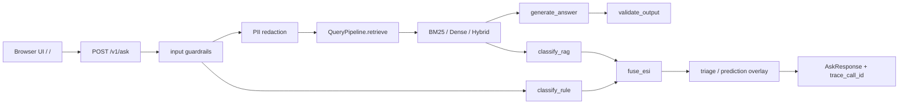

# Architecture

This repo is intentionally a single request-time workflow, not a generic AI platform.
The core path is:

```text
GET /                    → single-page visualizer
POST /v1/ask             → input guard → retrieval → generation → triage/fuse → output guard
evaluation/*             → golden-set eval + regression gate
docs/wandb.md            → trace model for per-stage debugging
```

## Request flow



## Where each concern lives

- `app/main.py` mounts the public surface and initializes tracing.
- `app/routers/web.py` serves the live UI and eval panel.
- `app/routers/ask.py` is the single workflow entrypoint.
- `retrieval/query_pipeline.py` is the retriever facade and fallback boundary.
- `retrieval/retriever.py`, `retrieval/dense.py`, `retrieval/hybrid_retriever.py` implement the engines.
- `generation/generate.py` produces grounded answers and citation output.
- `guardrails/input_validator.py` and `guardrails/output_validator.py` handle safety and reject paths.
- `workflows/classify_esi.py` turns retrieved examples into triage labels.
- `app/prediction.py` adds the forward-looking operational signal.
- `evaluation/ragas_runner.py`, `evaluation/multi_method_eval.py`, and `evaluation/regression_gate.py` form the quality loop.

## What a reviewer can verify

- `make test` proves the request contract still works.
- `make eval` writes `outputs/eval_summary.json`.
- `make gate` blocks metric regressions against `evaluation/baseline.json`.
- `docs/wandb.md` explains how the trace tree is supposed to answer “what ran, what failed, what fell back”.

## Current senior signal

This repo is stronger than a demo because it has:

- a single runtime workflow with explicit boundaries,
- runnable evaluation against a golden set,
- observable stage timings and trace IDs,
- safety rails before and after generation,
- a clear fallback story for dense / hybrid retrieval.

The remaining work is mostly presentation polish and richer proof artifacts, not missing core mechanics.
