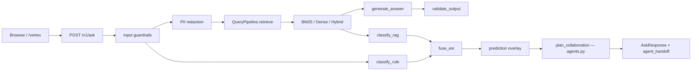

# Architecture

POST /v1/ask runs one bounded pipeline, then optionally hands off to action agents.

```text
POST /v1/ask
  → input guard (sanitize · injection · PII mask)
  → retrieval  (BM25 / dense / hybrid over 497-row corpus)
  → generation (grounded answer + citation validation)
  → triage     (rule-based + RAG-KNN ESI fusion)
  → prediction (LOS · risk · bed pressure signal)
  → agent handoff (ER Triage → Bed Ops → Care Follow-up)
  → output guard (citation valid · forbidden actions · length)
  → AskResponse JSON
```

## Request flow


```mermaid
flowchart LR
    A[Browser / /vertex] --> B[POST /v1/ask]
    B --> C[input guardrails]
    C --> D[PII redaction]
    D --> E[QueryPipeline.retrieve]
    E --> F[BM25 / Dense / Hybrid]
    F --> G[generate_answer]
    G --> H[validate_output]
    F --> I[classify_rag]
    C --> J[classify_rule]
    I --> K[fuse_esi]
    J --> K
    K --> L[prediction overlay]
    L --> M[plan_collaboration — agents.py]
    M --> N[AskResponse + agent_handoff]
```

## Multi-agent handoff

`app/agents.py` returns a deterministic collaboration graph — not a free-running swarm.

```text
ER Triage Agent
  -> Bed Ops Agent        (NOW + bed pressure / long LOS → execute capacity action)
  -> Care Follow-up Agent (SOON/WAIT + future risk → schedule monitoring)
```

Each node carries: `handoff_key` (idempotency), `retry_policy.max_attempts`, `stop_conditions`, `escalation` owner. Graph capped at 3 nodes. `app/bed_ops_agent.py` executes the Bed Ops node — reads live ER state, computes `assign_bed / board_ed / divert / discharge_plan`.

## Where each concern lives

- `app/main.py` — mounts routers + initializes tracing
- `app/routers/ask.py` — single pipeline entrypoint
- `app/routers/vertex.py` — ER Insight Console (4-pane doctor UI)
- `app/routers/web.py` — simple demo web page
- `app/agents.py` — multi-agent handoff planner
- `app/bed_ops_agent.py` — Bed Ops execution agent (reads ER state → disposition)
- `app/prediction.py` — LOS / risk / bed-pressure forward signal
- `app/grounding.py` — 4-lane evidence contract (doc / struct / web / vid)
- `retrieval/query_pipeline.py` — retriever facade + fallback boundary
- `retrieval/retriever.py` · `dense.py` · `hybrid_retriever.py` — BM25 / dense / RRF engines
- `generation/generate.py` — grounded answer + optional LLM call
- `generation/citations.py` — validates every claim cites a real source_id
- `guardrails/` — input/output validators + PII masker
- `workflows/classify_esi.py` — rule-based + RAG-KNN ESI classification
- `evaluation/ragas_runner.py` · `regression_gate.py` — quality loop + CI gate
- `evaluation/agent_eval.py` — agent handoff correctness eval (8 scenarios)

## What a reviewer can verify

```bash
make test        # 53 tests green
make eval        # writes outputs/eval_summary.json
make gate        # blocks metric regressions vs baseline.json
make agent-eval  # writes outputs/agent_eval_summary.json
```
